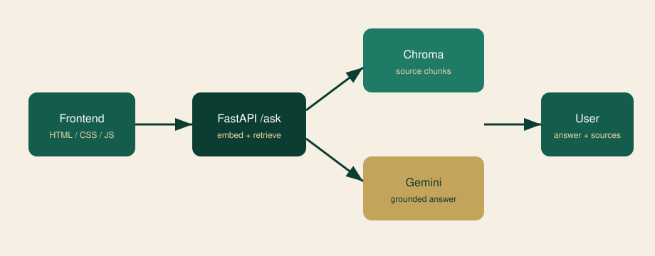
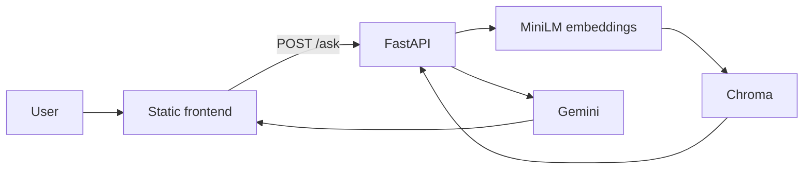

# Seerah RAG Assistant

A question-answering app for the life of the Prophet Muhammad ﷺ. Answers are generated only from a small set of curated Seerah notes, and every reply lists the source labels that were retrieved.

Built as a Maulidur Rasul / “Vibe Code” hackathon submission: grounded RAG instead of an unsourced chatbot.

**Live demo:** _add your Vercel URL after deploy_

## Problem

People who want to learn Seerah often face dense multi-volume books or general chatbots that can invent unsourced religious claims. This project answers a single question at a time, retrieves the most similar passages from vetted files, and asks Gemini to answer **only** from those passages. If nothing relevant is found, it says so.

## Architecture





**Ingest (once, or on empty startup):** read `backend/data/seerah_sources/`, split into overlapping word chunks, embed with `all-MiniLM-L6-v2`, store in a local Chroma collection.

**Query:** embed the question → top 5 similar chunks → strict prompt → `{ answer, sources }`.

## Tech stack

| Layer | Choice |
| --- | --- |
| Backend | FastAPI |
| Vectors | Chroma (disk, no hosted DB) |
| Embeddings | sentence-transformers `all-MiniLM-L6-v2` |
| LLM | Google Gemini (`gemini-3.6-flash`) |
| Frontend | HTML, CSS, JavaScript |
| Hosting | Render (API) + Vercel (static UI) |

## Local setup

1. Create a [Google AI Studio](https://aistudio.google.com/apikey) API key.
2. Backend:

```bash
cd backend
python -m venv .venv
# Windows: .venv\Scripts\activate
# macOS/Linux: source .venv/bin/activate
pip install -r requirements.txt
copy .env.example .env   # Windows
# cp .env.example .env   # macOS/Linux
```

3. Put your key in `backend/.env` as `GEMINI_API_KEY`.
4. Build the vector store (first run downloads the embedding model):

```bash
python -m app.ingest
```

5. Start the API from `backend/`:

```bash
uvicorn app.main:app --reload --port 8000
```

6. Frontend (needed so CORS origin is not `file://`):

```bash
cd frontend
python -m http.server 5500
```

Open [http://localhost:5500](http://localhost:5500).

If the collection is empty, the API also runs ingest on startup.

## Source files

Each file in `backend/data/seerah_sources/` starts with a citation line:

```text
Source: Ar-Raheeq Al-Makhtum (The Sealed Nectar), ...
```

The rest is an **original English study summary** for retrieval, labelled so facts can be traced to named works (primarily Ar-Raheeq Al-Makhtum and Ibn Hisham / Ibn Ishaq). These files are not verbatim copies of those books. Replace or extend them with your own licensed excerpts if you need denser coverage.

## API

`POST /ask`

```json
{ "question": "What happened at Badr?" }
```

```json
{
  "answer": "...",
  "sources": ["Ar-Raheeq Al-Makhtum ... — Badr, Uhud, and the Trench"]
}
```

Empty or missing `question` → **400**. Gemini failures → **502** with a short message (no stack traces). `GET /health` reports chunk count.

## Deploy

**Backend (Render web service)**

- Root: `backend/`
- Build: `pip install -r requirements.txt`
- Start: `uvicorn app.main:app --host 0.0.0.0 --port $PORT`
- Env: `GEMINI_API_KEY`, `ALLOWED_ORIGIN` (your Vercel origin, e.g. `https://your-app.vercel.app`)
- First boot downloads the embedding model and may ingest sources; free-tier cold start can take 30–60+ seconds

**Frontend (Vercel)**

- Root: `frontend/`
- Framework: Other (static)
- In `frontend/script.js`, set the non-localhost `API_BASE` to your Render URL

## Screenshots

Add images under `docs/screenshots/` after you run the app (empty chat, a cited answer, and an out-of-scope question).

## Cost

All intended pieces are free-tier: GitHub, local Chroma, local embeddings, Gemini free quota, Render, Vercel. Render sleeps after idle time, which is why the UI warns about a slow first request.

## Future improvements

- English, Korean, and Malay
- Multi-turn memory
- Admin upload of new sources without redeploy
- A self-hosted open model instead of Gemini, to avoid rate limits

## License

MIT. Seerah content in `backend/data/seerah_sources/` is original summary text for this project; cited classical works remain the rights of their authors and publishers.
